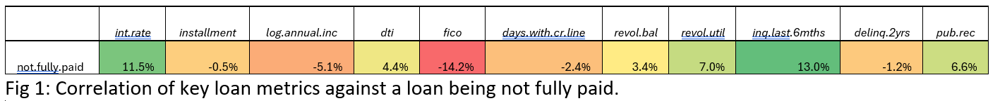
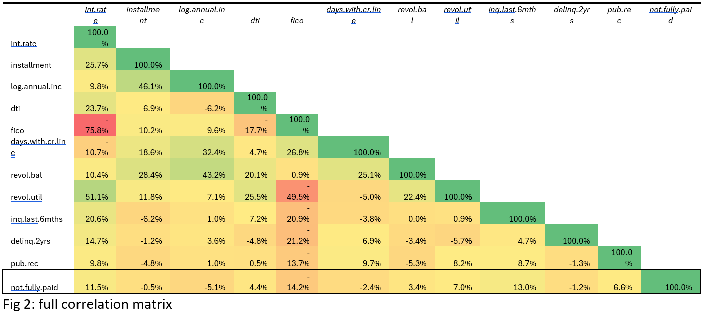
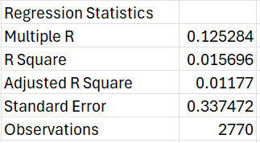

# Hi there 👋

## My Data Science Project
### Predicting Loan Repayments

Raw Data
[data 1](https://www.kaggle.com/datasets/itssuru/loan-data?resource=download) 

this figure shows the executive summary results of the correlation matrix

this figure shows the full summary results of the correlation matrix

this shows the summary output on the training dataset, however with such a low adjusted R squared value, this already highlights concerns in the train/test split as this value should be as close to 1 as possible

this shows the P-values of the various matricies, anything over 0.05 should be omitted from the linear regression model as not statistically significant

### References
[reference 1](https://www.legislation.gov.uk/ukpga/2018/12/contents)
[reference 2](https://ico.org.uk/action-weve-taken/enforcement/)
[reference 3](https://ico.org.uk/for-organisations/uk-gdpr-guidance-and-resources/individual-rights/individual-rights/)

<!--
**BP0323908/BP0323908** is a ✨ _special_ ✨ repository because its `README.md` (this file) appears on your GitHub profile.

Here are some ideas to get you started:

- 🔭 I’m currently working on ...
- 🌱 I’m currently learning ...
- 👯 I’m looking to collaborate on ...
- 🤔 I’m looking for help with ...
- 💬 Ask me about ...
- 📫 How to reach me: ...
- 😄 Pronouns: ...
- ⚡ Fun fact: ...
-->
